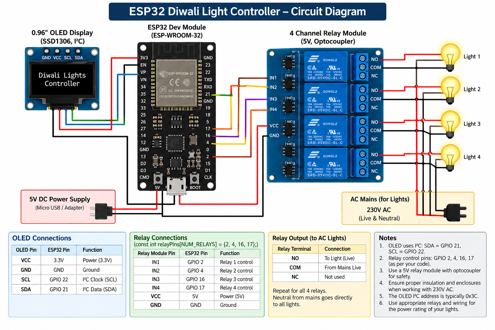
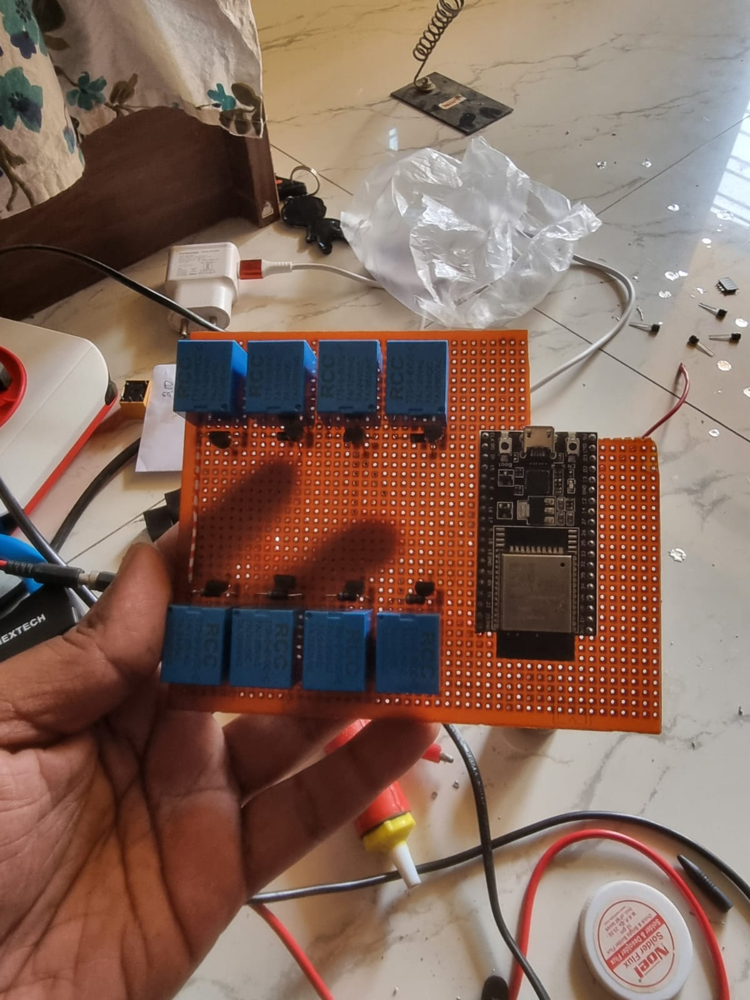

# WI-FI enabled ESP32 Diwali Light Controller

An ESP32-based smart Diwali light controller that drives relay-controlled lights through configurable lighting patterns. The system provides Wi-Fi-based TCP control, an SSD1306 OLED display for real-time status, and adjustable pattern speed and duration.

## Demo

[Watch Demo Video](assets/working_demo.mp4)

## Features

- 10 pre-configured lighting patterns
- Control up to 4 relay outputs
- Wi-Fi connectivity with TCP server on port 8080
- 0.96" SSD1306 OLED for real-time system status
- Adjustable pattern speed and run duration
- Automatic and manual pattern control
- Automatic Wi-Fi reconnection
- Real-time status reporting over TCP

## Hardware

| Component | Description |
|---|---|
| ESP32 | Main controller |
| 4-Channel Relay Module | Controls the Diwali lights |
| SSD1306 OLED | I2C status display |
| Diwali Lights | Connected through relay outputs |
| 5V Power Supply | Power source |

## Connections

### Circuit Diagram



### Referance Zero board



### OLED

| OLED Pin | ESP32 |
|---|---|
| VCC | 3.3V |
| GND | GND |
| SDA | GPIO 21 |
| SCL | GPIO 22 |
| I2C Address | `0x3C` |

### Relay Module

| Relay | ESP32 GPIO |
|---|---|
| Relay 1 | GPIO 2 |
| Relay 2 | GPIO 4 |
| Relay 3 | GPIO 16 |
| Relay 4 | GPIO 17 |

## Software Requirements

Install the following before compiling the project:

- ESP32 Arduino Core
- Adafruit GFX Library
- Adafruit SSD1306 Library

## Configuration

Update the Wi-Fi credentials in the `.ino` file:

```cpp
const char* ssid = "YOUR_WIFI_SSID";
const char* password = "YOUR_WIFI_PASSWORD";
```

The TCP server runs on port:

```text
8080
```

After connecting to Wi-Fi, the ESP32 displays its IP address on the OLED and Serial Monitor.

## Control Commands

Commands can be sent through a TCP client connected to the ESP32.

| Command | Description |
|---|---|
| `ON` | Turn all relays ON |
| `OFF` | Turn all relays OFF |
| `AUTO` | Start automatic pattern cycling |
| `P1` - `P10` | Select a lighting pattern |
| `M P1` - `M P10` | Run a selected pattern continuously |
| `SPD+` | Increase pattern speed |
| `SPD-` | Decrease pattern speed |
| `STEP 500` | Set pattern step interval to 500 ms |
| `S 500` | Set pattern step interval |
| `SPEED 500` | Set pattern step interval |
| `RUN 10000` | Set pattern duration to 10 seconds |
| `RUNMS 10000` | Set pattern duration in milliseconds |

## Operating Modes

### AUTO

Automatically runs the selected lighting patterns and advances to the next pattern after the configured run duration.

### MANUAL LOOP

Runs the selected pattern continuously until another command is received.

### MANUAL STATIC

Maintains the current relay state without automatically advancing the pattern.

## OLED Display

The OLED provides information such as:

- Wi-Fi connection status
- ESP32 IP address
- Current operating mode
- Active pattern and step
- Individual relay states
- Current pattern mask
- Pattern step interval
- Pattern run duration

## Lighting Patterns

The controller supports 10 predefined lighting patterns. Each pattern consists of a sequence of relay masks.

Example:

```text
1110
1101
1011
0111
```

Each bit represents a relay:

```text
Bit 0 -> Relay 1
Bit 1 -> Relay 2
Bit 2 -> Relay 3
Bit 3 -> Relay 4
```

The patterns can be modified in the source code to create custom lighting effects.

## Serial Monitor

Use the following baud rate:

```text
115200
```

The Serial Monitor provides information about:

- Wi-Fi connection
- ESP32 IP address
- Received commands
- Current pattern and step
- Relay states
- Pattern transitions
- Wi-Fi reconnection attempts

## Project Structure

```text
ESP32-Diwali-Light-Controller/
|
├── diwali-light.ino
└── README.md
```

## Safety

If the relay outputs control 230V AC or other mains-powered lights:

- Use properly rated relays and wiring.
- Keep low-voltage ESP32 circuitry isolated from mains voltage.
- Use appropriate insulation and electrical enclosures.
- Do not work on energized mains circuits.
- Have mains wiring performed or checked by a qualified electrician.

## License

This project is licensed under the MIT License.

```text
MIT License

Copyright (c) 2026

Permission is hereby granted, free of charge, to any person obtaining a copy
of this software and associated documentation files (the "Software"), to deal
in the Software without restriction, including without limitation the rights
to use, copy, modify, merge, publish, distribute, sublicense, and/or sell
copies of the Software, and to permit persons to whom the Software is
furnished to do so, subject to the following conditions:

The above copyright notice and this permission notice shall be included in all
copies or substantial portions of the Software.

THE SOFTWARE IS PROVIDED "AS IS", WITHOUT WARRANTY OF ANY KIND, EXPRESS OR
IMPLIED, INCLUDING BUT NOT LIMITED TO THE WARRANTIES OF MERCHANTABILITY,
FITNESS FOR A PARTICULAR PURPOSE AND NONINFRINGEMENT. IN NO EVENT SHALL THE
AUTHORS OR COPYRIGHT HOLDERS BE LIABLE FOR ANY CLAIM, DAMAGES OR OTHER
LIABILITY, WHETHER IN AN ACTION OF CONTRACT, TORT OR OTHERWISE, ARISING FROM,
OUT OF OR IN CONNECTION WITH THE SOFTWARE OR THE USE OR OTHER DEALINGS IN THE
SOFTWARE.
```
